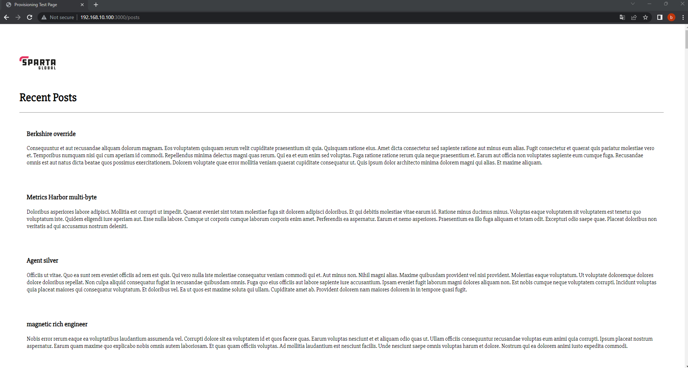

# Deploying the Sparta app and connecting to the Database

## Why did we do this?

## Creating a Vagrant file and download app folders
* In VScode, bring up the terminal and change the launch profile to bash. Then enter the command ```vagrant init``` to bring up a vagrant file
* Download the folders from the developers and unzip them
* Then move the folders from your downloads to the same directory that your vagrant file is in
* Now we need to change the configuration in the vagrant file


## App configuration


* We have named the VM "app" to differentiate from other VM's
* We want the VM to have Ubuntu and to use bionic64
* We have provided a private IP to be able to view the app page
* We have stated that there is a shell script that we would like the VM to use on launch, we have stated the path of where to fine the file and the name of the file
* As the script is in the same location we did not need to provide the absolute path but just the name
* Then we have synced the app folder over to the VM by stating the name of the file and the path

## Database configuration


* Similarly to before we have stated the name of this vm - "db"
* We also want it to have Ubuntu
* We have again provided a private IP however this one is slightly different
* We changed the last number from 100 to 150, this IP is still in the same range as the app however it cannot use the same IP address
* We have also set up a shell script for the database which we have stated again in this configuration
* However this time we created the script in a different location so we needed to provide the absolute path

## Shell script for app
* Now that we have configured the vagrant file we need to set up the shell scripts that we have asked vagrant to read from and execute
* The shell script for the app VM should look like this


* In this we have first told the VM to update and upgrade
* Then we have said to install the dependencies for the app to run which is nginx, python software properties, nodejs and pm2
* For nodejs we have first said to download a specifc version of nodejs and then in the second command we have said to instal that version
* Then we have said that once it is up and running it needs to go to the app location
* Then to install the app using npm install
* Then use node app.js to run the app

## Shell script for DB
* The shell script for the database should look like this


* The first part follows the same as the app with update and upgrade
* Then we provide a public key for Mongo
* Then we verify the key
* Again update and upgrade
* Next it installs Mongo
* Then we start Mongo

## Run the VM's
* We then need to run ```vagrant up``` in a Git Bash terminal in VS to launch both VM's
* We can then view the Sparta App page by going to this IP ```192.168.10.100:3000```
* This is the IP we provided in the configuration file and we need to add ```:3000``` on the end as we do not have a reverse proxy
* You will then see this page


## Connecting the app to the database
* Use ```vagrant ssh db``` to access the database VM
* Type ```sudo nano /etc/mongod.conf``` to open the mongo configuration file
* Scroll to the ```bindip``` and change it to ```0.0.0.0```


* Then we need to restart and enable mongo using ```sudo systemctl restart mongod``` and ```sudo systemctl enable mongod```
* Next we need to open another Git Bash terminal and use ```vagrant ssh app```
* In this we need to do ```sudo nano .bashrc``` to open the .bashrc file and create an environment variable
* Scorll to the bottom of the file and put this in export ```DB_HOST=mongodb://192.168.10.150:27017/posts```
* Save and exit and then run ```source .bashrc``` to implement the change
* We need to seed the database now so navigate to the app using ```cd app```
* Then use node ```node seeds/seed.js``` to seed the database
* Then start the app using ```node app.js```
* To view the posts page enter this IP ```192.168.10.100:3000/posts``` into a browser



<!-- * Why did we do this? prepping for launch app on AWS, learning Linux, why 2 tier is good
* State what the app and database is - mongo database
* Maybe say what a port is
* Add some screenshots of the database set up
* Explain what the env variable does - connects the two, it tells app where it needs to go to get the information
* Prep to explain seeding -->